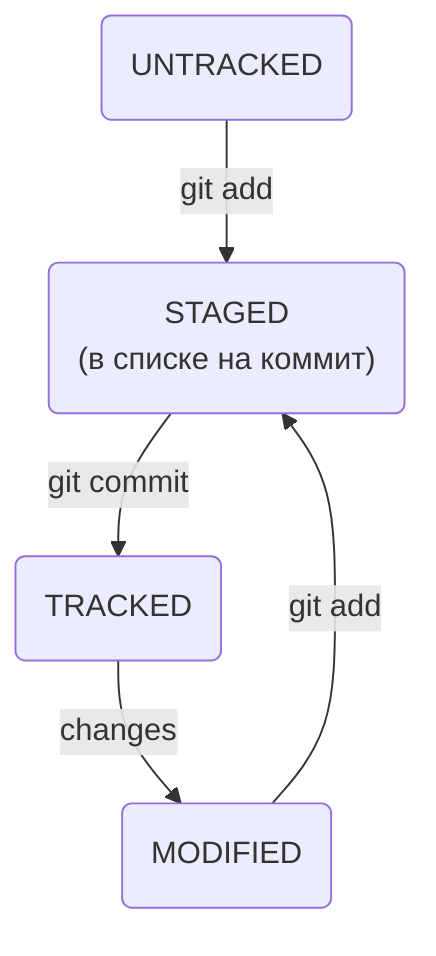

# Basic commands Git <br>

## git init <br>

(от англ. initialize, «инициализировать») — to initialize repository. <br>
----

### Getting ready to commit <br>

```bash
git add *file to add*
``` 

(от англ. *add*, «добавить») — getting ready `todo.txt` to commit <br>

```bash
git add --all
``` 

(от англ. *add*, «добавить» + *all*, «всё») — get ready to all files: edited or/and created files <br>

```bash
git add .
```

— get ready to commit this directory <br>
----

### Creating commit <br>

```bash
git commit -m "Комментарий к коммиту."
``` 

(от англ. commit, «совершать», «фиксировать» + message, «сообщение») — do commit and leave a message to make it easy for others (-m for message) <br>
----

### Information about commit history <br>

```bash
git log
```

(от англ. log, «журнал [записей]») — output information about commits. <br>
----

### States of files <br>

```bash
git status
``` 

(от англ. status, «статус», «состояние») — show current state of files.

---

## information about log

### hash

(Хеширование (от англ. hash, «рубить», «крошить», «мешанина») — это способ преобразовать набор данных и получить их
«отпечаток» (англ. fingerprint))

(Информация о коммите — это набор данных: когда был сделан коммит, содержимое файлов в репозитории на момент коммита и
ссылка на предыдущий, или родительский (англ. parent), коммит. Git хеширует (преобразует) эту информацию с помощью
алгоритма SHA-1 (от англ. Secure Hash Algorithm — «безопасный алгоритм хеширования») и получает для каждого коммита свой
уникальный хеш — результат хеширования)

